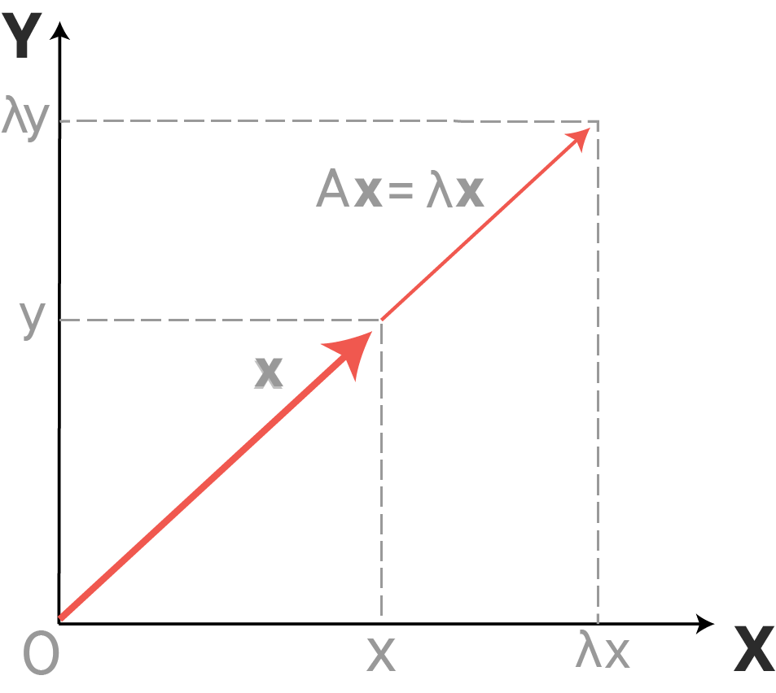

# PCA Background: Covariance Matrix and Eigendecomposition

## Introduction 

Now that you've gotten a high-level overview of the use cases for PCA and some general notes regarding the algorithm's implementation, its time to dive deeper into the theory behind PCA. In particular, you'll break down some of the primary concepts of the algorithm, including the covariance matrix and eigenvectors.


## Objectives 

You will be able to:

- Perform a covariance matrix calculation with NumPy  
- Explain eigendecomposition and its basic characteristics 
- Explain the role of eigenvectors and eigenvalues in eigendecomposition 
- Decompose and reconstruct a matrix using eigendecomposition 


## The PCA Algorithm

Recall that the general procedure for PCA is:  
    
1. Recenter each feature of the dataset by subtracting that feature's mean from the feature vector
2. Calculate the covariance matrix for your centered dataset
3. Calculate the eigenvectors of the covariance matrix
4. Project the dataset into the new feature space: Multiply the eigenvectors by the mean-centered features

With that, let's start deconstructing some of these concepts.

## Covariance

You've looked into correlation and covariance as measures to calculate how one random variable changes with respect to another. 

Covariance is very similar to correlation, but is not normalized. The formula for the covariance of two variables $X$ and $Y$ is:

$$cov(X,Y) = \frac{\sum_i^n(X_i -\mu_X)(Y_i - \mu_Y)}{n-1}$$


## The Covariance Matrix

Now that you've seen covariance on its own, let's briefly examine a covariance matrix.

The covariance matrix for a set of data with $n$ dimensions would be:

$$C^{n x n} = (c_{i,j}, c_{i,j} = cov(Dim_i, Dim_j))$$

where $C^{n x n}$ is a matrix with $n$ rows and $n$ columns, and $Dim_x$ is the $i$th dimension.

So if you have an n-dimensional dataset, then the matrix has $n$ rows and $n$ columns (square matrix) and each entry in the matrix is the result of calculating the covariance between two separate dimensions as shown below:


- Down the main diagonal, we can see that the covariance value is between one of the dimensions and itself. These are the variances for that dimension

- Since $cov(a,b) = cov(b,a)$, the matrix is symmetric about the main diagonal  


## Calculate Covariance matrix in NumPy

In NumPy, you can calculate the covariance of a given matrix using `np.cov()` function, as shown below:


```python
import numpy as np
X = np.array([[0.1, 0.3, 0.4, 0.8, 0.9], 
              [3.2, 2.4, 2.4, 0.1, 5.5], 
              [10., 8.2, 4.3, 2.6, 0.9]])

print(X)
```

    [[ 0.1  0.3  0.4  0.8  0.9]
     [ 3.2  2.4  2.4  0.1  5.5]
     [10.   8.2  4.3  2.6  0.9]]


```python
print(np.cov(X))
```

    [[ 0.115   0.0575 -1.2325]
     [ 0.0575  3.757  -0.8775]
     [-1.2325 -0.8775 14.525 ]]


The diagonal elements, $C_{ii}$ are the variances in the variables $x_i$ assuming $N−1$ degrees of freedom:


```python
print(np.var(X, axis=1, ddof=1))
```

    [ 0.115  3.757 14.525]


## Eigendecomposition

The eigendecomposition is one form of matrix decomposition. Decomposing a matrix means that you want to find a product of matrices that is equal to the initial matrix. In the case of the eigendecomposition, you decompose the initial matrix into the product of its __eigenvectors__ and __eigenvalues__.
 
A vector $v$ is an __eigenvector__ of a __square__ matrix $A$ if it satisfies the following equation:

$$Av = \lambda v$$.


Here, __lambda__ ($\lambda$) represents the __eigenvalue__ scalar.

> A matrix can have one eigenvector and eigenvalue for each dimension of the parent matrix. 

Also, remember that not all square matrices can be decomposed into eigenvectors and eigenvalues, and some can only be decomposed in a way that requires complex numbers.

__The parent matrix can be shown to be a product of the eigenvectors and eigenvalues.__

$$A = Q . diag(V) . Q^{-1}$$

$Q$ is a matrix comprised of the eigenvectors, $diag(V)$ is a diagonal matrix comprised of the __eigenvalues__ along the diagonal (and zeros everywhere else), and $Q^{-1}$ is the inverse of the matrix comprised of the eigenvectors.

A decomposition operation breaks down a matrix into constituent parts to make certain operations on the matrix easier to perform. Eigendecomposition is used as an element to simplify the calculation of other, more complex matrix operations.

## Eigenvectors and Eigenvalues

__Eigenvectors__ are unit vectors, with length or magnitude equal to 1.0. They are often referred to as right vectors, which simply means a column vector (as opposed to a row vector or a left vector). Imagine a transformation matrix that, when multiplied on the left, reflected vectors in the line $y=x$. You can see that if there were a vector that lay on the line $y=x$, it’s reflection is itself. This vector (and all multiples of it), would be an eigenvector of that transformation matrix.




__Eigenvalues__ are coefficients applied to eigenvectors that give the vectors their length or magnitude. For example, a negative eigenvalue may reverse the direction of the eigenvector as part of scaling it. Eigenvalues are closely related to eigenvectors.

A matrix that has only positive eigenvalues is referred to as a __positive definite matrix__, whereas if the eigenvalues are all negative, it is referred to as a __negative definite matrix__.

Decomposing a matrix in terms of its eigenvalues and its eigenvectors gives valuable insights into the properties of the matrix. Certain matrix calculations, like computing the power of the matrix, become much easier when we use the eigendecomposition of the matrix. The eigendecomposition can be calculated in NumPy using the `eig()` function.

The example below first defines a 3×3 square matrix. The eigendecomposition is calculated on the matrix returning the eigenvalues and eigenvectors using the `eig()` function.


```python
# Eigendecomposition
from numpy import array
from numpy.linalg import eig
# Define matrix
A = array([[1, 2, 3], [4, 5, 6], [7, 8, 9]])
print(A)
print('-----------------')
# Calculate eigendecomposition
values, vectors = eig(A)
print(values)
print('-----------------')
print(vectors)
```

    [[1 2 3]
     [4 5 6]
     [7 8 9]]
    -----------------
    [ 1.61168440e+01 -1.11684397e+00 -9.75918483e-16]
    -----------------
    [[-0.23197069 -0.78583024  0.40824829]
     [-0.52532209 -0.08675134 -0.81649658]
     [-0.8186735   0.61232756  0.40824829]]


## Testing an Eigenvector

Above, the eigenvectors are returned as a matrix with the same dimensions as the parent matrix (3x3), where each column is an eigenvector, e.g. the first eigenvector is vectors[:,0]. Eigenvalues are returned as a list, where value indices in the returned array are paired with eigenvectors by column index, e.g. the first eigenvalue at values[0] is paired with the first eigenvector at vectors[: 0].

You can also test whether the first vector and value are in fact an eigenvalue and eigenvector for the matrix.


```python
# Confirm first eigenvector
B = A.dot(vectors[:, 0])
print(B)
print('-----------------')
C = vectors[:, 0] * values[0]
print(C)
```

    [ -3.73863537  -8.46653421 -13.19443305]
    -----------------
    [ -3.73863537  -8.46653421 -13.19443305]


## Reconstruct Original Matrix

You can also reverse the process and reconstruct the original matrix given only the eigenvectors and eigenvalues.

First, the list of eigenvectors must be converted into a matrix, where each vector becomes a row. The eigenvalues need to be arranged into a diagonal matrix. The NumPy `diag()` function can be used for this. Next, you need to calculate the inverse of the eigenvector matrix, which we can be achieved with the `inv()` function. Finally, these elements need to be multiplied together with the `.dot()` method.


```python
from numpy.linalg import inv
# Create matrix from eigenvectors
Q = vectors

# Create inverse of eigenvectors matrix
R = inv(Q)

# Create diagonal matrix from eigenvalues
L = np.diag(values)

# Reconstruct the original matrix
B = Q.dot(L).dot(R)
print(B)
```

    [[1. 2. 3.]
     [4. 5. 6.]
     [7. 8. 9.]]


## Summary 

In this lesson, you looked at calculating the covariance matrix for a given matrix. You also looked at eigendecomposition and its implementation in Python. You can now go ahead and use these skills to apply principal component analysis for a multidimensional dataset using these skills.  
